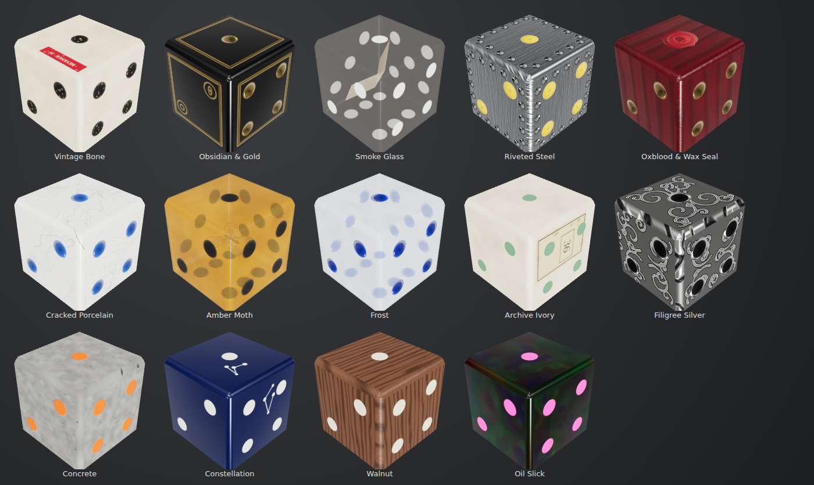

# Sargas Dice Set

Animated 3D dice for **Foundry VTT v14**. Every roll made by any game system is thrown on screen in one of fourteen hand-designed Sargas styles, and lands on the real result. GMs can turn each style on or off for their world.



| | | | | |
|---|---|---|---|---|
| Vintage Bone | Obsidian & Gold | Smoke Glass | Riveted Steel | Oxblood & Wax Seal |
| Cracked Porcelain | Amber Moth | Frost | Archive Ivory | Filigree Silver |
| Concrete | Constellation | Walnut | Oil Slick | |

All dice kinds are supported: d4, d6, d8, d10, d12, d20 and d100 (shown as a tens die plus a units die). The d6 uses pips, as in the original designs; the other dice show numerals in the style's pip colour.

## Installation

In Foundry's **Add-on Modules → Install Module**, paste this manifest URL:

```
https://github.com/sargas79/sargas-dice-set/releases/latest/download/module.json
```

Then enable **Sargas Dice Set** in your world. Don't run it at the same time as Dice So Nice, or every roll will animate twice.

## Using it

- **Rolls animate automatically:** chat commands (`/r 2d20kh`), sheet rolls, and anything posted with `Roll#toMessage`. The chat card waits until the dice stop (this can be turned off).
- **Pick your style:** *Game Settings → Configure Settings → Sargas Dice Set → Choose dice styles.* Everyone at the table sees your dice in your style.
- **Turn styles on or off (GM):** use the same menu. Each style has its own **Enabled in this world** flag, and players can only pick enabled styles. If a player's style is turned off, their dice switch to the first enabled style and they get a notification. If every style is off, no 3D dice are shown.
- **Private and blind rolls:** GM-only (`/gmr`) and self (`/sr`) rolls only animate for the players who receive them. For blind rolls (`/br`), players who can't see the result get dice that land on a random face (or nothing, depending on a setting).

### Settings

| Setting | Scope | Default |
|---|---|---|
| Show 3D dice | client | on |
| Render quality (low / medium / high) | client | medium |
| Animation speed | client | 1× |
| Time on table | client | 2 s |
| Dice sound volume | client | 50% |
| Show other players' rolls | client | on |
| Hold chat until dice stop | world | on |
| Dice size | world | 1× |
| Maximum dice per roll | world | 20 |
| Rolls you cannot see | world | show dice without the real result |

## API

```js
const dice = game.modules.get("sargas-dice-set").api;

// Show dice for a roll that isn't posted to chat (e.g. from a macro).
await dice.show(new Roll("3d6"), { synchronize: true }); // synchronize: also show on other clients

// Add your own style from another module.
Hooks.once("sargasDiceInit", api => api.registerStyle({
  id: "my-style", name: "My Style", label: "MYMODULE.MyStyle",
  body: { color: "#224466", roughness: 0.3 },
  pips: { kind: "paint", color: "#ffffff" },
  sound: "resin"
}));
```

Hooks: `sargasDiceInit(api)`, `sargasDiceRollStart({rolls, user, style, dice})`, `sargasDiceRollComplete({rolls, user, style})`.

## How it works

- **Renderer:** a transparent full-screen Three.js overlay that doesn't block clicks. It only renders while dice are moving.
- **Physics:** cannon-es, seeded with the chat message id, so every client plays the same throw. The result is **never** decided by the physics. After the throw is simulated, the die mesh is turned by one of the solid's own symmetry rotations so that Foundry's rolled value ends up on top. The shape and its path don't change.
- **Textures:** generated in code on first use: wood grain, cracks, concrete pitting, brushed steel, filigree, pips and numerals. The module ships no image files, and styles that are turned off are never generated.
- **Sounds:** collision sounds are synthesised with WebAudio, varying by material (wood, glass, metal, stone and so on).

## Development

```bash
npm install
npm test            # unit tests (geometry, physics, roll parsing, style flags, Foundry wiring)
npm run build       # bundles dist/sargas-dice-set.js
npm run watch       # rebuild on change
npm run demo        # builds the standalone preview at demo/index.html
node tools/screenshots.mjs out "mode=gallery"            # headless screenshots
node tools/screenshots.mjs out "mode=kinds&style=walnut" # one style on every die kind
```

To develop inside Foundry, clone or link this repository into `Data/modules/sargas-dice-set` and run `npm run build`.

Releases are built by GitHub Actions. Pushing a `v*` tag, or running the **Release** workflow manually, runs the tests, builds the bundle, and publishes `module.zip` and `module.json` to a GitHub release.

## License

MIT. See [LICENSE](LICENSE).
